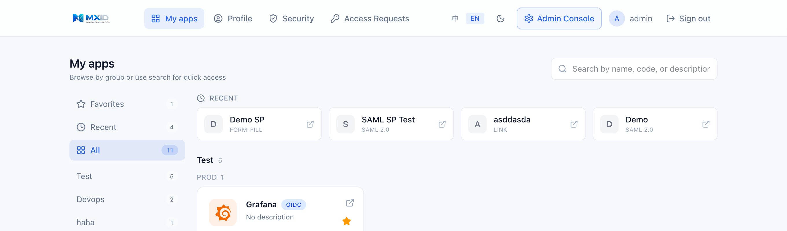
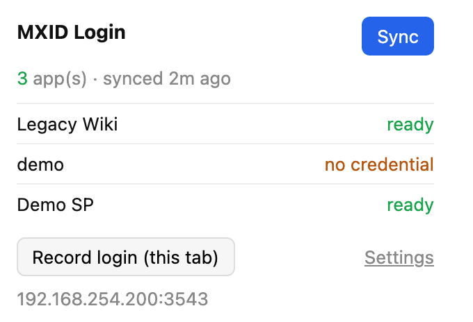

<div align="center">

# MXID

**Open-source, multi-protocol Identity & Access Management (IAM / SSO) platform**

One login portal, one admin console, one protocol gateway — speak **OIDC**,
**SAML 2.0**, **CAS 3.0** and **JWT** so every app plugs into a single identity layer.

[](LICENSE)
[](docs/EDITIONS.md)
[](https://go.dev)
[](https://react.dev)
[](https://www.postgresql.org)
[](https://redis.io)
<br/>
[](https://github.com/imkerbos/mxid/releases)
[](https://github.com/imkerbos/mxid/stargazers)
[](https://github.com/imkerbos/mxid/issues)
[](https://github.com/imkerbos/mxid/commits)

**English** · [简体中文](README_ZH.md)

</div>

---

MXID is a self-hosted, single-tenant IAM platform built for commercial-grade
deployments — multi-language and benchmarked against Keycloak / Auth0 / Okta /
TopIAM. It ships as **open core**: a fully usable Community Edition under AGPL,
plus an Enterprise Edition that unlocks external IdP login, white-label branding
and more via a signed license.

> **v1.4.1** — latest stable release. See the [releases](https://github.com/imkerbos/mxid/releases) for the changelog. :tada:

<div align="center">



</div>

## Highlights

- **Protocols out of the box** — OpenID Connect 1.0 (on OAuth 2.0; PKCE, Refresh, RP-Initiated Logout), SAML 2.0 (IdP/SP-initiated, SLO), CAS 3.0, JWT. Per-app claim/attribute mappers.
- **Authentication** — password policy (strength, history, lockout, captcha), TOTP MFA + recovery codes, magic-link, external IdP login (Enterprise).
- **Identity & access** — users, organizations, groups, RBAC; per-app access policies and per-app roles propagated as claims.
- **Form-fill SSO (SWA)** — onboard legacy web apps that only have a username/password form. MXID vaults the downstream credential and a hardened MV3 browser extension auto-fills + submits the app's own login. Per-user or shared credentials, capture-to-configure, step-up-gated + token-bound reveal (Enterprise).
- **Runtime, not rebuild** — SMTP, security policy, branding, login methods, protocol defaults and URLs are all admin-editable at runtime through the console.
- **Operations** — audit log with retention + alert webhook, API tokens (OpenAPI), i18n (Chinese + English).
- **Production-ready delivery** — single-binary backend + containerized edge; tag-driven multi-arch images; Ed25519-signed offline licensing.
- **Stateless backend / Kubernetes-ready** — icons and brand logos are stored as `bytea` in PostgreSQL (≤ 2 MB, strong ETag cache); no local disk state, no PVC required. Every replica serves the same assets immediately after startup.
- **Honest capability advertisement** — `/system/info` reports only the features present in the running binary: runtime-gated features (`branding`, `conditional_access` — code ships in CE, unlocked by license) are distinguished from code-separated EE-only features (`external_idp`, etc., absent from the CE binary).

## Architecture

```
                       ┌────────────────────────────────┐
                       │            End User             │
                       └───────────────┬────────────────┘
                                       ▼
                       ┌────────────────────────────────┐
                       │   Portal SPA (Vite + React)     │
                       │   /login  /consent  /apps       │
                       └───────────────┬────────────────┘
                                       │ session cookie
        ┌──────────────────────────────▼─────────────────────────────┐
        │                    MXID Backend (Go)                        │
        │  ┌────────────────┐ ┌───────────────┐ ┌──────────────────┐ │
        │  │ Protocol GW    │ │ AuthN Engine  │ │ Settings Domain  │ │
        │  │ OIDC/SAML/CAS  │ │ password+TOTP │ │ hot-reload (SMTP │ │
        │  │ JWT            │ │ +external IdP │ │ branding/policy) │ │
        │  └───────┬────────┘ └───────┬───────┘ └──────────────────┘ │
        │          └────────┬─────────┘                              │
        │          ┌────────▼─────────┐  ┌──────────────────┐        │
        │          │ Identity Resolver│  │ Access / Roles   │        │
        │          │ user/group/org   │  │ per-app policy   │        │
        │          └────────┬─────────┘  └────────┬─────────┘        │
        │     ┌─────────────▼─────────────────────▼────────────┐     │
        │     │  Console SPA (admin) — /users /apps /orgs       │     │
        │     └─────────────────────────────────────────────────┘    │
        └──────────────────────────────┬─────────────────────────────┘
                  ┌────────────────────┼────────────────────┐
                  ▼                    ▼                    ▼
        ┌──────────────────┐ ┌──────────────────┐ ┌──────────────────┐
        │   PostgreSQL     │ │      Redis       │ │   SMTP / SMS     │
        │ tenants/users/   │ │ sessions/        │ │   provider       │
        │ apps/audit ...   │ │ tickets/events   │ │                  │
        └──────────────────┘ └──────────────────┘ └──────────────────┘
                  ▲
                  └─────────── External SPs: Grafana · JumpServer · Jira · Harbor · …
```

Go backend (Gin + GORM + Redis + Snowflake IDs). React 19 + Vite + TypeScript +
Tailwind (pnpm workspaces: `console`, `portal`, `shared`). PostgreSQL primary
store; Redis for sessions / tickets / TOTP rate-limit / event SSE.

## Quick start (development)

```bash
git clone https://github.com/imkerbos/mxid.git
cd mxid
cp .env.example .env
make dev-docker-up          # backend + console + portal + air hot-reload
```

Dev runs behind a dev nginx on **port 3500** (hot-reload, not for production):

| Surface | URL |
|---------|-----|
| Portal (end users) | <http://localhost:3500/> |
| Console (admin) | <http://localhost:3500/admin/> — default `admin` / `admin123` |
| API | <http://localhost:3500/api/v1/...> |
| OIDC discovery | <http://localhost:3500/protocol/oidc/.well-known/openid-configuration> |

**Production** is a different path: pull the released images and run behind nginx
on **80 / 443** (TLS), via `docker compose`. Paths are identical — only the host
and ports change:

```bash
make prod-docker-up         # production compose (released images, TLS-ready)
```

The backend is fully stateless — brand assets live in the database, so
horizontal scaling and Kubernetes deployments need no shared volume.
See **[docs/DEPLOYMENT.md](docs/DEPLOYMENT.md)**. For the deeper
design see [docs/ARCHITECTURE.md](docs/ARCHITECTURE.md).

## Editions

MXID is **open core**. The Community Edition is free and fully usable; the
Enterprise Edition unlocks additional features via an Ed25519-signed offline
license, activated in the console (no restart). Full details, architecture,
activation and limits: **[docs/EDITIONS.md](docs/EDITIONS.md)**.

### Function List

| Feature | Community Edition | Enterprise Edition |
|---------|:---:|:---:|
| **Protocols** | | |
| OpenID Connect 1.0 / OAuth 2.0 (PKCE / Refresh / RP-Initiated Logout) | ✅ | ✅ |
| SAML 2.0 (IdP/SP-initiated, SLO) | ✅ | ✅ |
| CAS 3.0 | ✅ | ✅ |
| JWT (HS256 / RS256) | ✅ | ✅ |
| **Authentication** | | |
| Password login + policy (strength / history / lockout / captcha) | ✅ | ✅ |
| TOTP MFA + recovery codes | ✅ | ✅ |
| Magic-link (passwordless) | ✅ | ✅ |
| External IdP login (Lark / Feishu / Teams) | ❌ | ✅ |
| SMS OTP login | ❌ | ✅ |
| Conditional / risk-based access | ❌ | ✅ |
| Advanced step-up (sudo mode) | ❌ | ✅ |
| WebAuthn / Passkeys | ❌ | ✅ ¹ |
| **Identity & Access** | | |
| Users | ✅ up to 100 | ✅ unlimited |
| Organizations / Groups | ✅ | ✅ |
| RBAC (roles + permissions) | ✅ | ✅ |
| SCIM 2.0 provisioning | ❌ | ✅ ¹ |
| **Applications & SSO** | | |
| App registration (OIDC / SAML / CAS / JWT) | ✅ unlimited | ✅ unlimited |
| Per-app access policy (user / group / org / role) | ✅ | ✅ |
| Per-app roles → claims | ✅ | ✅ |
| API tokens (OpenAPI) | ✅ | ✅ |
| Form-fill SSO (SWA) — browser-extension auto-login for password-only web apps | ❌ | ✅ |
| **Operations** | | |
| Audit log + retention + alert webhook | ✅ | ✅ |
| SMTP email + templates | ✅ | ✅ |
| i18n (Chinese / English) | ✅ | ✅ |
| Branding / white-label (logo, colors, login page) | ❌ | ✅ |

¹ On the roadmap.

> On license expiry the instance gracefully reverts to Community limits — logins
> keep working and existing data is grandfathered; only new creation past the CE
> cap is blocked until renewal.

## Integrations (battle-tested)

The console ships built-in integration guides at `/admin/docs`:

| App | Protocol | Status |
|-----|----------|--------|
| Grafana | OIDC | ✅ `groups` claim → `role_attribute_path` |
| JumpServer v4 | CAS 3.0 | ✅ user auto-create, attribute sync |
| Harbor / Gitea / Jira / Confluence / Jenkins / AWS / Lark | OIDC / SAML / CAS | see `/admin/docs` |

## Form-fill SSO (browser extension)

Not every internal system speaks OIDC / SAML / CAS. For legacy web apps that only
have a username + password form, MXID ships **form-fill SSO** (a.k.a. SWA — Secure
Web Authentication): the downstream credential is vaulted in MXID and the **MXID
Login** browser extension types it into the app's *own* login form. MXID never
talks to the app, and the password never leaves the browser at fill time.


**How it works**

1. An admin registers the app with protocol **Form-fill** — login URL + field
   selectors, or let the extension **record** a real login and generate them.
2. The user installs the **MXID Login** extension (Chrome / Edge, Manifest V3).
   Intranet deployments push it via enterprise policy + a self-hosted CRX — no
   Chrome Web Store required.
3. Credentials are stored **per-user** (each user vaults their own) or **shared**
   (an admin sets one for everyone) — the two modes coexist per app.
4. Opening the app's login page → the extension reveals the credential and
   auto-fills + submits. Reveal is gated by the portal session **+ a token-bound
   per-install secret + step-up MFA + the app's access policy**, and every reveal
   is audited.

<p align="center"></p>

**One-step setup** — the extension's *Record login* captures the field selectors
**and** stores the credential in a single pass, so a user onboards an app by
logging into it once. Users who'd rather not vault a password simply skip it: the
app degrades to a plain launcher and they type the password manually.

Design & security: [form-fill design](docs/FORM-FILL-SSO-DESIGN.md) ·
[security spec](docs/FORM-FILL-SSO-B0-SECURITY-SPEC.md) ·
[extension token binding](docs/FORM-FILL-EXTENSION-TOKEN-BINDING.md).

## Project layout

```
mxid/
├── cmd/server/        # thin main → app.Run() (CE entrypoint)
├── app/               # server wiring (importable; EE reuses via app.Run)
├── internal/
│   ├── bootstrap/     # config, router, app shell
│   ├── domain/        # user / app / tenant / org / group / permission / authn / audit / setting / ...
│   ├── protocol/      # OIDC / SAML / CAS handlers
│   ├── gateway/       # console (admin REST) + portal (end-user REST)
│   └── middleware/    # cors, logger, request-id, feature gate
├── pkg/
│   └── ee/            # license (Ed25519 verify) + registry (EE extension seam)
├── migrations/        # SQL
├── web/               # console + portal + shared (React, pnpm workspaces)
├── deploy/            # compose / dockerfile / nginx
└── docs/              # DEPLOYMENT / EDITIONS / ARCHITECTURE
```

## Star history

[](https://star-history.com/#imkerbos/mxid&Date)

## Contributing

- [CONTRIBUTING.md](CONTRIBUTING.md) — dev setup, branch + commit conventions, lint/test pipeline.
- [SECURITY.md](SECURITY.md) — vulnerability reporting.
- [CODE_OF_CONDUCT.md](CODE_OF_CONDUCT.md).
- Bugs / features: [GitHub Issues](https://github.com/imkerbos/mxid/issues).

## License

Copyright © 2026 **MatrixPlus**. MXID is **open core**:

- **Community Edition** (this repository) — **GNU Affero General Public License v3.0** ([LICENSE](LICENSE)). Running a modified MXID as a network service requires publishing your modifications under the same license.
- **Enterprise Edition** — the `mxid-ee` distribution and EE-gated features are governed by a **commercial license** ([LICENSE.EE](LICENSE.EE)). See [docs/EDITIONS.md](docs/EDITIONS.md).
